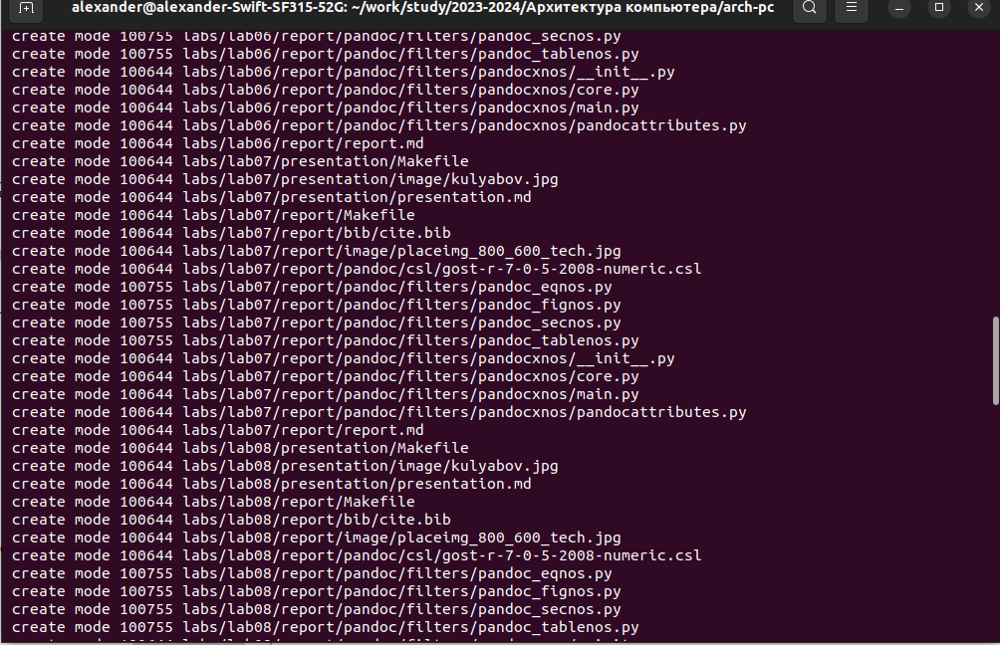

---
## Front matter
title: "Отчет по лабораторной работе №2"
subtitle: "Архитектура компьютера и операционные системы"
author: "Александр Дмитриевич Собко"

## Generic otions
lang: ru-RU
toc-title: "Содержание"

## Bibliography
bibliography: bib/cite.bib
csl: pandoc/csl/gost-r-7-0-5-2008-numeric.csl

## Pdf output format
toc: true # Table of contents
toc-depth: 2
lof: true # List of figures
lot: true # List of tables
fontsize: 12pt
linestretch: 1.5
papersize: a4
documentclass: scrreprt
## I18n polyglossia
polyglossia-lang:
  name: russian
  options:
  - spelling=modern
  - babelshorthands=true
polyglossia-otherlangs:
  name: english
## I18n babel
babel-lang: russian
babel-otherlangs: english
## Fonts
mainfont: PT Serif
romanfont: PT Serif
sansfont: PT Sans
monofont: PT Mono
mainfontoptions: Ligatures=TeX
romanfontoptions: Ligatures=TeX
sansfontoptions: Ligatures=TeX,Scale=MatchLowercase
monofontoptions: Scale=MatchLowercase,Scale=0.9
## Biblatex
biblatex: true
biblio-style: "gost-numeric"
biblatexoptions:
  - parentracker=true
  - backend=biber
  - hyperref=auto
  - language=auto
  - autolang=other*
  - citestyle=gost-numeric
## Pandoc-crossref LaTeX customization
figureTitle: "Рис."
tableTitle: "Таблица"
listingTitle: "Листинг"
lofTitle: "Список иллюстраций"
lotTitle: "Список таблиц"
lolTitle: "Листинги"
## Misc options
indent: true
header-includes:
  - \usepackage{indentfirst}
  - \usepackage{float} # keep figures where there are in the text
  - \floatplacement{figure}{H} # keep figures where there are in the text
---

# Цель работы

Целью работы является изучить идеологию и применение средств контроля версий. Приобрести практические навыки по работе с системой git.

# Задание

Настройка git, создание ssh-ключа, его подключение и практика основных команд

# Теоретическое введение

Системы контроля версий (Version Control System, VCS) применяются при работе
нескольких человек над одним проектом. Обычно основное дерево проекта хранится в
локальном или удалённом репозитории, к которому настроен доступ для участников проекта. При внесении изменений в содержание проекта система контроля версий позволяет
их фиксировать, совмещать изменения, произведённые разными участниками проекта,
производить откат к любой более ранней версии проекта, если это требуется.
В классических системах контроля версий используется централизованная модель, предполагающая наличие единого репозитория для хранения файлов. Выполнение большинства
функций по управлению версиями осуществляется специальным сервером. Участник проекта (пользователь) перед началом работы посредством определённых команд получает
нужную ему версию файлов. После внесения изменений, пользователь размещает новую
версию в хранилище. При этом предыдущие версии не удаляются из центрального хранилища и к ним можно вернуться в любой момент. Сервер может сохранять не полную версию
изменённых файлов, а производить так называемую дельта-компрессию — сохранять только
изменения между последовательными версиями, что позволяет уменьшить объём хранимых
данных.
Системы контроля версий поддерживают возможность отслеживания и разрешения конфликтов, которые могут возникнуть при работе нескольких человек над одним файлом.
Можно объединить (слить) изменения, сделанные разными участниками (автоматически
или вручную), вручную выбрать нужную версию, отменить изменения вовсе или заблокировать файлы для изменения. В зависимости от настроек блокировка не позволяет другим
пользователям получить рабочую копию или препятствует изменению рабочей копии файла
средствами файловой системы ОС, обеспечивая таким образом, привилегированный доступ
только одному пользователю, работающему с файлом.
Системы контроля версий также могут обеспечивать дополнительные, более гибкие функциональные возможности. Например, они могут поддерживать работу с несколькими версиями одного файла, сохраняя общую историю изменений до точки ветвления версий и
собственные истории изменений каждой ветви. Кроме того, обычно доступна информация
о том, кто из участников, когда и какие изменения вносил. Обычно такого рода информация
хранится в журнале изменений, доступ к которому можно ограничить.
В отличие от классических, в распределённых системах контроля версий центральный
репозиторий не является обязательным.
Среди классических VCS наиболее известны CVS, Subversion, а среди распределённых —
Git, Bazaar, Mercurial. Принципы их работы схожи, отличаются они в основном синтаксисом
используемых в работе команд.

# Выполнение лабораторной работы

1. Настройка github
Существует несколько доступных серверов репозиториев с возможностью бесплатного
размещения данных. Например, http://bitbucket.org/, https://github.com/ и https://gitflic.ru.
Для выполнения лабораторных работ предлагается использовать Github.
Создайте учётную запись на сайте https://github.com/ и заполните основные данные.
2. Базовая настройка git
Сначала сделаем предварительную конфигурацию git. Откройте терминал и введите
следующие команды, указав имя и email владельца репозитория:
git config --global user.name "<Name Surname>"
git config --global user.email "<work@mail>"

{#fig:001 width=70%}

Настроим utf-8 в выводе сообщений git:
git config --global core.quotepath false

{#fig:002 width=70%}

Зададим имя начальной ветки (будем называть её master):
git config --global init.defaultBranch master

{#fig:003 width=70%}

Параметр autocrlf:
git config --global core.autocrlf input

{#fig:004 width=70%}

Параметр safecrlf:
git config --global core.safecrlf warn

{#fig:005 width=70%}

3. Создание SSH ключа
Для последующей идентификации пользователя на сервере репозиториев необходимо
сгенерировать пару ключей (приватный и открытый):
ssh-keygen -C "Имя Фамилия <work@mail>"

{#fig:006 width=70%}

Ключи сохранятся в каталоге ~/.ssh/.
Далее необходимо загрузить сгенерированный открытый ключ. Для этого зайти на сайт http://github.org/ под своей учётной записью и перейти в меню Setting . После этого выбрать в боковом меню SSH and GPG keys и нажать кнопку New SSH key . Скопировав из локальной консоли ключ в буфер обмена 
cat ~/.ssh/id_rsa.pub | xclip -sel clip
вставляем ключ в появившееся на сайте поле и указываем для ключа имя (Title)

{#fig:007 width=70%}

4. Создание рабочего пространства и репозитория курса на основе шаблона
При выполнении лабораторных работ следует придерживаться структуры рабочего пространства. Рабочее пространство по предмету располагается в следующей иерархии:
~/work/study/
 <учебный год>/
   <название предмета>/
     <код предмета>/
Например, для 2023–2024 учебного года и предмета «Архитектура компьютера» (код предмета arch-pc) структура каталогов примет следующий вид:
~/work/study/
 2023–2024/
   Архитектура компьютера/
     arch-pc/
       labs/
        lab01/
        lab02/
        lab03/
        ...
Каталог для лабораторных работ имеет вид labs.
Каталоги для лабораторных работ имеют вид lab<номер>, например: lab01, lab02 и
т.д.
Название проекта на хостинге git имеет вид: study_<учебный год> <код предмета>
Например, для 2023–2024 учебного года и предмета «Архитектура компьютера» (код предмета arch-pc) название проекта примет следующий вид: study 2023–2024 arch-pc
Откройте терминал и создайте каталог для предмета «Архитектура компьютера»:
mkdir -p /work/study/2023-2024/"Архитектура компьютера"

5. Создание репозитория курса на основе шаблона
Репозиторий на основе шаблона можно создать через web-интерфейс github.
Перейдите на станицу репозитория с шаблоном курса https://github.com/yamadharma/course-directory-student-template.
Далее выберите Use this template.
В открывшемся окне задайте имя репозитория (Repository name) study_2023-2024_arch-pc и создайте репозиторий (кнопка Create repository from template).
Откройте терминал и перейдите в каталог курса:
cd /work/study/2023–2024/"Архитектура компьютера"
клонируйте созданный репозиторий:
git clone --recursive git@github.com:<user_name>/study_2023–2024_arch-pc.git
arch-pc

{#fig:008 width=70%}

6. Настройка каталога курса
Перейдите в каталог курса:
cd /work/study/2023-2024/"Архитектура компьютера"/arch-pc
Удалите лишние файлы:
rm package.json
Создайте необходимые каталоги:
echo arch-pc > COURSE
make
Отправьте файлы на сервер:
git add .
git commit -am 'feat(main): make course structure'
git push

{#fig:009 width=70%}

{#fig:010 width=70%}

{#fig:011 width=70%}

{#fig:012 width=70%}

{#fig:013 width=70%}

{#fig:014 width=70%}

{#fig:015 width=70%}

{#fig:016 width=70%}

Проверьте правильность создания иерархии рабочего пространства в локальном репозитории и на странице github.

{#fig:017 width=70%}

# Задание для самостоятельной работы

1. Создайте отчет по выполнению лабораторной работы в соответствующем каталоге
рабочего пространства (labs>lab02>report).

{#fig:018 width=70%}

2. Скопируйте отчеты по выполнению предыдущих лабораторных работ в соответствующие каталоги созданного рабочего пространства.

{#fig:019 width=70%}

3. Загрузите файлы на github

# Выводы

Мы научились пользоваться средством контроля версий git

# Список литературы{.unnumbered}

::: {#refs}
:::
