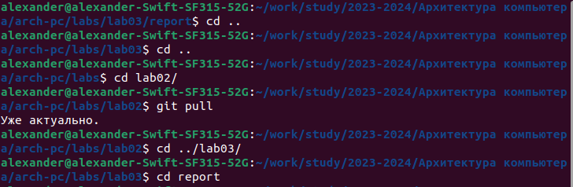
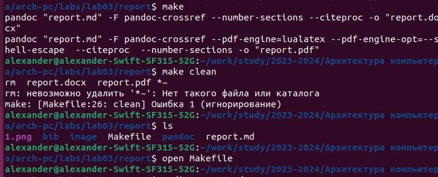
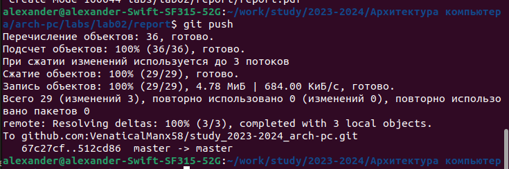

---
## Front matter
title: "Отчет по лабораторной работе №3"
subtitle: "Архитектура компьютера и операционные системы"
author: "Александр Дмитриевич Собко"

## Generic otions
lang: ru-RU
toc-title: "Содержание"

## Bibliography
bibliography: bib/cite.bib
csl: pandoc/csl/gost-r-7-0-5-2008-numeric.csl

## Pdf output format
toc: true # Table of contents
toc-depth: 2
lof: true # List of figures
lot: true # List of tables
fontsize: 12pt
linestretch: 1.5
papersize: a4
documentclass: scrreprt
## I18n polyglossia
polyglossia-lang:
  name: russian
  options:
	- spelling=modern
	- babelshorthands=true
polyglossia-otherlangs:
  name: english
## I18n babel
babel-lang: russian
babel-otherlangs: english
## Fonts
mainfont: PT Serif
romanfont: PT Serif
sansfont: PT Sans
monofont: PT Mono
mainfontoptions: Ligatures=TeX
romanfontoptions: Ligatures=TeX
sansfontoptions: Ligatures=TeX,Scale=MatchLowercase
monofontoptions: Scale=MatchLowercase,Scale=0.9
## Biblatex
biblatex: true
biblio-style: "gost-numeric"
biblatexoptions:
  - parentracker=true
  - backend=biber
  - hyperref=auto
  - language=auto
  - autolang=other*
  - citestyle=gost-numeric
## Pandoc-crossref LaTeX customization
figureTitle: "Рис."
tableTitle: "Таблица"
listingTitle: "Листинг"
lofTitle: "Список иллюстраций"
lotTitle: "Список таблиц"
lolTitle: "Листинги"
## Misc options
indent: true
header-includes:
  - \usepackage{indentfirst}
  - \usepackage{float} # keep figures where there are in the text
  - \floatplacement{figure}{H} # keep figures where there are in the text
---

# Цель работы

Цель данной работы - изучение языка разметки markdown

# Задание

Установка ПО, заполнение отчета лабораторной работы 3 и 2 с помощью языка разметки markdown.

# Теоретическое введение

Markdown — это простой язык разметки, используемый для создания форматированного текста (например, HTML) с помощью текстового редактора. Он позволяет добавлять к тексту базовое форматирование, используя символы, известные и доступные на всех клавиатурах. Размер шрифта, цвет и другие расширенные параметры недоступны в Markdown.

# Выполнение лабораторной работы

1. Откройте терминал

2. Перейдите в каталог курса сформированный при выполнении лабораторной работы
№2
Обновите локальный репозиторий

3. Перейдите в каталог с шаблоном отчета по лабораторной работе № 3

{#fig:001 width=70%}

4. Проведите компиляцию шаблона с использованием Makefile. Для этого введите команду
При успешной компиляции должны сгенерироваться файлы report.pdf и report.docx.
Откройте и проверьте корректность полученных файлов.

5. Удалите полученный файлы с использованием Makefile.
Проверьте, что после этой команды файлы report.pdf и report.docx были удалены.

6. Откройте файл report.md c помощью любого текстового редактора, например gedit

{#fig:002 width=70%}

7. Заполните отчет и скомпилируйте отчет с использованием Makefile. Проверьте корректность полученных файлов. (Обратите внимание, для корректного отображения скриншотов они должны быть размещены в каталоге image)

8. Загрузите файлы на Github.

# Задание для самостоятельной работы

1. В соответствующем каталоге сделайте отчёт по лабораторной работе № 2 в формате
Markdown. В качестве отчёта необходимо предоставить отчёты в 3 форматах: pdf, docx
и md.

2. Загрузите файлы на github.

{#fig:003 width=70%}

# Выводы

Мы сделали два отчета с помощью языка разметки markdown и научились им пользоваться. Также мы научились скачивать программмное обеспечение и справляться с некоторыми ошибками при компиляции (например скачать недостающие шрифты)

# Список литературы{.unnumbered}

::: {#refs}
:::
