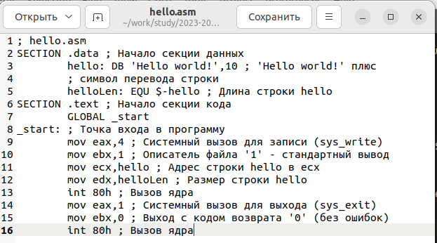
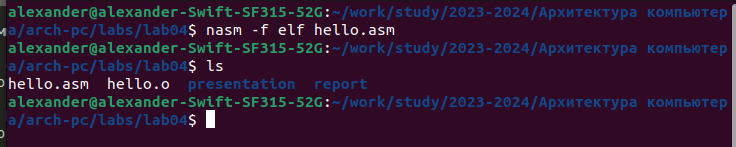
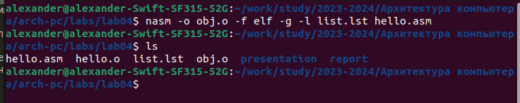
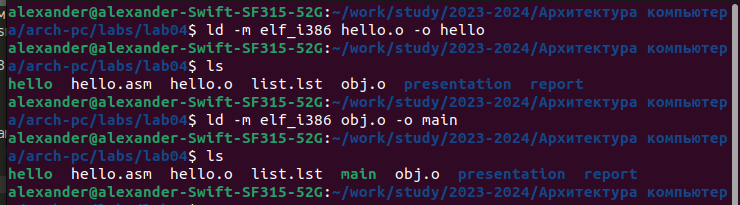
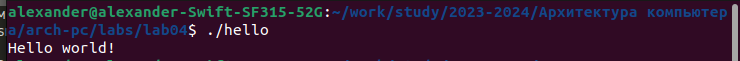
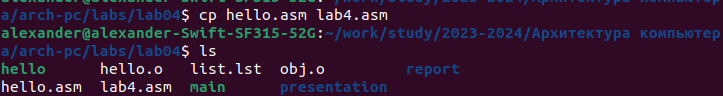
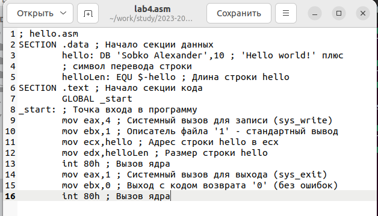
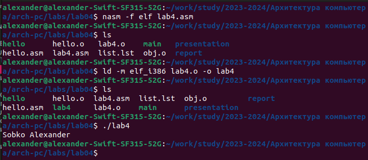

---
## Front matter
title: "Отчет по лабораторной работе №4"
subtitle: "Архитектура компьютера и операционные системы"
author: "Александр Дмитриевич Собко"

## Generic otions
lang: ru-RU
toc-title: "Содержание"

## Bibliography
bibliography: bib/cite.bib
csl: pandoc/csl/gost-r-7-0-5-2008-numeric.csl

## Pdf output format
toc: true # Table of contents
toc-depth: 2
lof: true # List of figures
lot: true # List of tables
fontsize: 12pt
linestretch: 1.5
papersize: a4
documentclass: scrreprt
## I18n polyglossia
polyglossia-lang:
  name: russian
  options:
  - spelling=modern
  - babelshorthands=true
polyglossia-otherlangs:
  name: english
## I18n babel
babel-lang: russian
babel-otherlangs: english
## Fonts
mainfont: PT Serif
romanfont: PT Serif
sansfont: PT Sans
monofont: PT Mono
mainfontoptions: Ligatures=TeX
romanfontoptions: Ligatures=TeX
sansfontoptions: Ligatures=TeX,Scale=MatchLowercase
monofontoptions: Scale=MatchLowercase,Scale=0.9
## Biblatex
biblatex: true
biblio-style: "gost-numeric"
biblatexoptions:
  - parentracker=true
  - backend=biber
  - hyperref=auto
  - language=auto
  - autolang=other*
  - citestyle=gost-numeric
## Pandoc-crossref LaTeX customization
figureTitle: "Рис."
tableTitle: "Таблица"
listingTitle: "Листинг"
lofTitle: "Список иллюстраций"
lotTitle: "Список таблиц"
lolTitle: "Листинги"
## Misc options
indent: true
header-includes:
  - \usepackage{indentfirst}
  - \usepackage{float} # keep figures where there are in the text
  - \floatplacement{figure}{H} # keep figures where there are in the text
---

# Цель работы

Освоение процедуры компиляции и сборки программ, написанных на ассемблере NASM.

# Задание

Написание, компиляция и запуск первых программ написанных на ассемблере

# Теоретическое введение

Основными функциональными элементами любой электронно-вычислительной машины
(ЭВМ) являются центральный процессор, память и периферийные устройства (рис. 4.1).
Взаимодействие этих устройств осуществляется через общую шину, к которой они подключены. Физически шина представляет собой большое количество проводников, соединяющих
устройства друг с другом. В современных компьютерах проводники выполнены в виде электропроводящих дорожек на материнской (системной) плате.

Язык ассемблера (assembly language, сокращённо asm) — машинно-ориентированный
язык низкого уровня. Можно считать, что он больше любых других языков приближен к
архитектуре ЭВМ и её аппаратным возможностям, что позволяет получить к ним более
полный доступ, нежели в языках высокого уровня,таких как C/C++, Perl, Python и пр. Заметим,
что получить полный доступ к ресурсам компьютера в современных архитектурах нельзя,
самым низким уровнем работы прикладной программы является обращение напрямую к
ядру операционной системы. Именно на этом уровне и работают программы, написанные
на ассемблере. Но в отличие от языков высокого уровня ассемблерная программа содержит
только тот код, который ввёл программист. Таким образом язык ассемблера — это язык, с
помощью которого понятным для человека образом пишутся команды для процессора

# Выполнение лабораторной работы

## Программа Hello world!

Рассмотрим пример простой программы на языке ассемблера NASM. Традиционно первая
программа выводит приветственное сообщение Hello world! на экран.
Создайте каталог для работы с программами на языке ассемблера NASM.
Перейдите в созданный каталог
Создайте текстовый файл с именем hello.asm
откройте этот файл с помощью любого текстового редактора, например, gedit и введите в него следующий текст:

{#fig:001 width=70%}

## Транслятор NASM

NASM превращает текст программы в объектный код. Например, для компиляции приведённого выше текста программы «Hello World» необходимо написать:

Если текст программы набран без ошибок, то транслятор преобразует текст программы
из файла hello.asm в объектный код, который запишется в файл hello.o. Таким образом,
имена всех файлов получаются из имени входного файла и расширения по умолчанию.
При наличии ошибок объектный файл не создаётся, а после запуска транслятора появятся
сообщения об ошибках или предупреждения.
С помощью команды ls проверьте, что объектный файл был создан. Какое имя имеет
объектный файл?

{#fig:002 width=70%}

## Расширенный синтаксис командной строки NASM

Выполните следующую команду:
```
nasm -o obj.o -f elf -g -l list.lst hello.asm
```
Данная команда скомпилирует исходный файл hello.asm в obj.o (опция -o позволяет
задать имя объектного файла, в данном случае obj.o), при этом формат выходного файла
будет elf, и в него будут включены символы для отладки (опция -g), кроме того, будет создан
файл листинга list.lst (опция -l).
С помощью команды ls проверьте, что файлы были созданы.
Для более подробной информации см. man nasm. Для получения списка форматов объектного файла см. nasm -hf.

{#fig:003 width=70%}

## Компоновщик LD

Чтобы получить исполняемую программу, объектный файл
необходимо передать на обработку компоновщику:
```
ld -m elf_i386 hello.o -o hello
```
С помощью команды ls проверьте, что исполняемый файл hello был создан.
Компоновщик ld не предполагает по умолчанию расширений для файлов, но принято
использовать следующие расширения:
• o – для объектных файлов;
• без расширения – для исполняемых файлов;
• map – для файлов схемы программы;
• lib – для библиотек.
Ключ -o с последующим значением задаёт в данном случае имя создаваемого исполняемого файла.
Выполните следующую команду:
```
ld -m elf_i386 obj.o -o main
```
{#fig:004 width=70%}

## Запуск исполняемого файла

{#fig:005 width=70%}

# Задание для самостоятельной работы

1. В каталоге ~/work/arch-pc/lab04 с помощью команды cp создайте копию файла
hello.asm с именем lab4.asm

{#fig:006 width=70%}

2. С помощью любого текстового редактора внесите изменения в текст программы в
файле lab4.asm так, чтобы вместо Hello world! на экран выводилась строка с вашими
фамилией и именем.

{#fig:007 width=70%}

3. Оттранслируйте полученный текст программы lab4.asm в объектный файл. Выполните компоновку объектного файла и запустите получившийся исполняемый файл

{#fig:008 width=70%}

4. Скопируйте файлы hello.asm и lab4.asm в Ваш локальный репозиторий в каталог ~/work/study/2023-2024/"Архитектура компьютера"/arch-pc/labs/lab04/.
Загрузите файлы на Github.


# Выводы

Узнали основные этапы получения исполняемого файла и сделали его.

# Список литературы{.unnumbered}

::: {#refs}
:::
