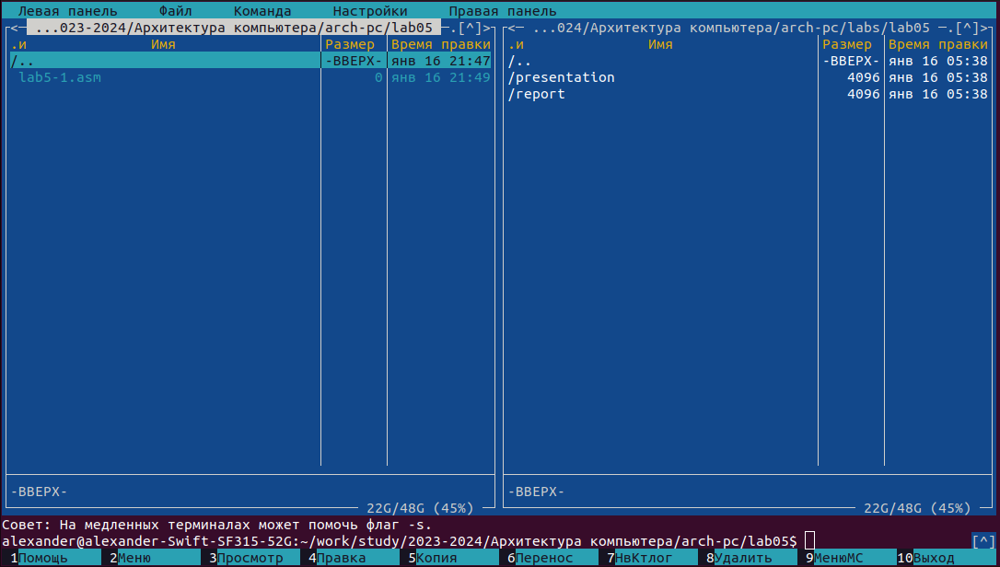
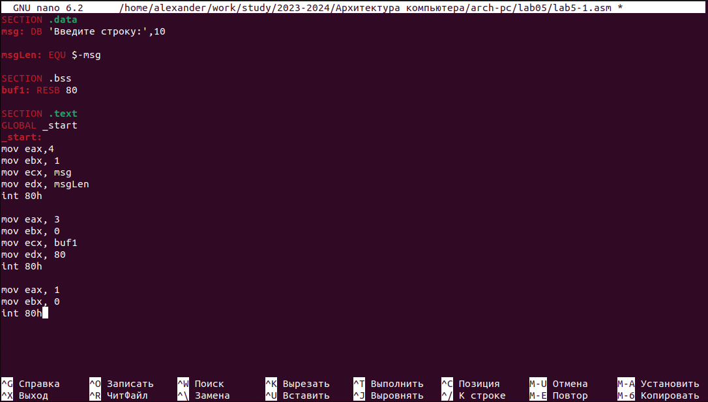
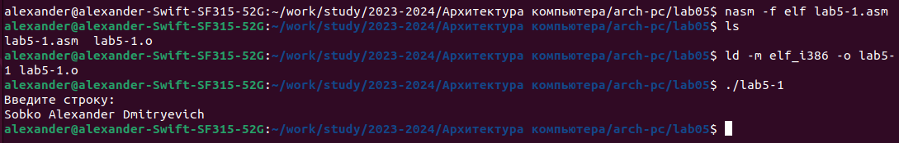
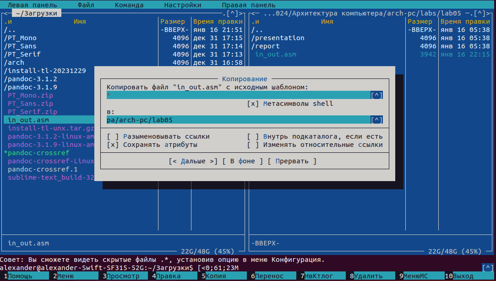
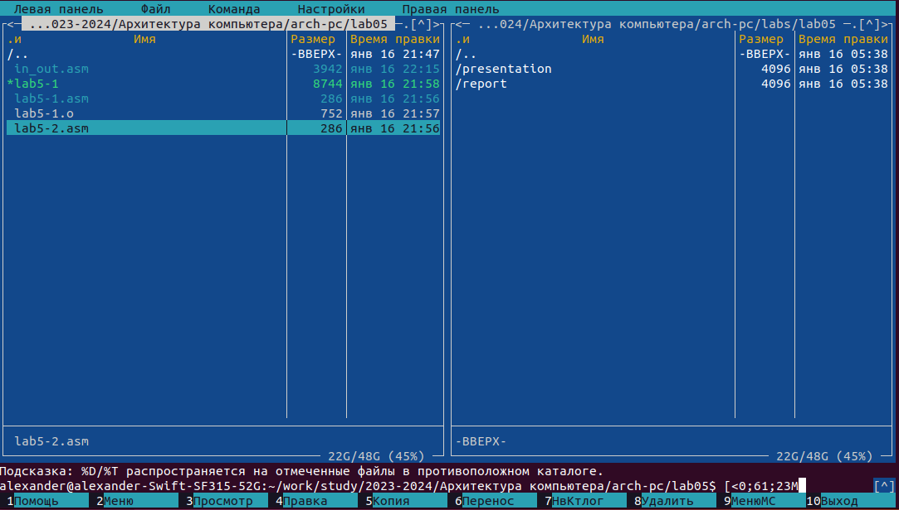
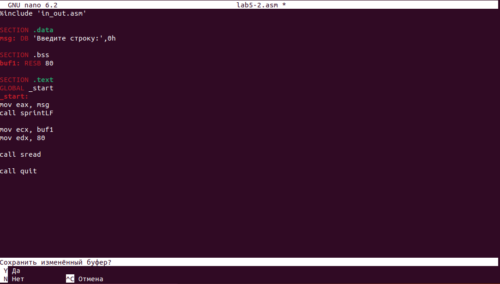
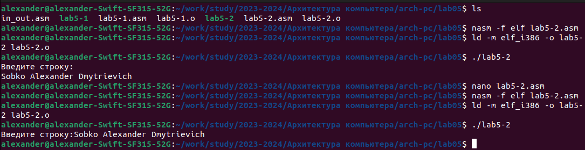
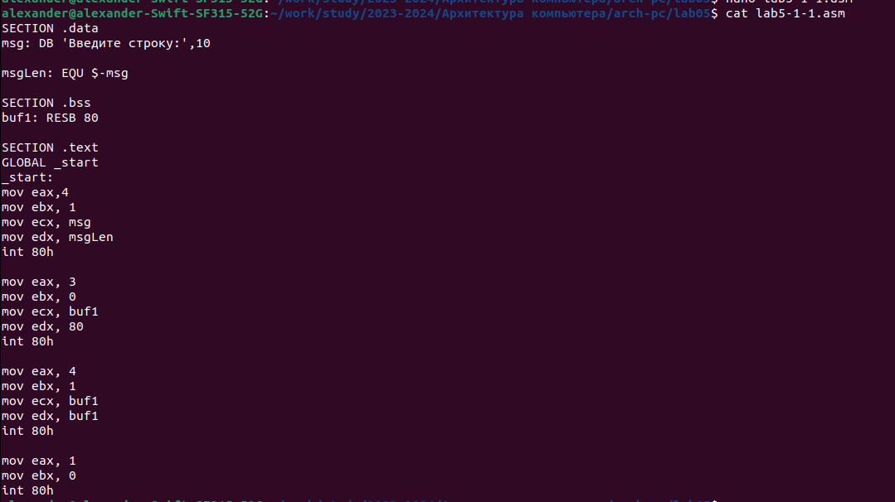
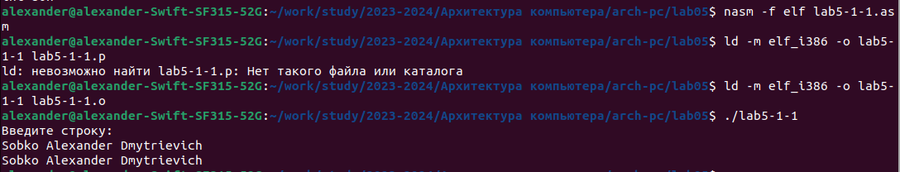
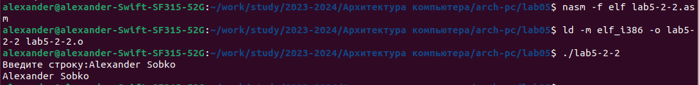

---
## Front matter
title: "Отчет по лабораторной работе №5"
subtitle: "Архитектура компьютера и операционные системы"
author: "Александр Дмитриевич Собко"

## Generic otions
lang: ru-RU
toc-title: "Содержание"

## Bibliography
bibliography: bib/cite.bib
csl: pandoc/csl/gost-r-7-0-5-2008-numeric.csl

## Pdf output format
toc: true # Table of contents
toc-depth: 2
lof: true # List of figures
lot: true # List of tables
fontsize: 12pt
linestretch: 1.5
papersize: a4
documentclass: scrreprt
## I18n polyglossia
polyglossia-lang:
  name: russian
  options:
  - spelling=modern
  - babelshorthands=true
polyglossia-otherlangs:
  name: english
## I18n babel
babel-lang: russian
babel-otherlangs: english
## Fonts
mainfont: PT Serif
romanfont: PT Serif
sansfont: PT Sans
monofont: PT Mono
mainfontoptions: Ligatures=TeX
romanfontoptions: Ligatures=TeX
sansfontoptions: Ligatures=TeX,Scale=MatchLowercase
monofontoptions: Scale=MatchLowercase,Scale=0.9
## Biblatex
biblatex: true
biblio-style: "gost-numeric"
biblatexoptions:
  - parentracker=true
  - backend=biber
  - hyperref=auto
  - language=auto
  - autolang=other*
  - citestyle=gost-numeric
## Pandoc-crossref LaTeX customization
figureTitle: "Рис."
tableTitle: "Таблица"
listingTitle: "Листинг"
lofTitle: "Список иллюстраций"
lotTitle: "Список таблиц"
lolTitle: "Листинги"
## Misc options
indent: true
header-includes:
  - \usepackage{indentfirst}
  - \usepackage{float} # keep figures where there are in the text
  - \floatplacement{figure}{H} # keep figures where there are in the text
---

# Цель работы

Приобретение практических навыков работы в Midnight Commander. Освоение инструкций языка ассемблера mov и int

# Задание

Научиться пользоваться mc, использовать импортировать функции, так же выводить сообщения в терминал

# Теоретическое введение

Midnight Commander (или просто mc) — это программа, которая позволяет просматривать
структуру каталогов и выполнять основные операции по управлению файловой системой,
т.е. mc является файловым менеджером. Midnight Commander позволяет сделать работу с
файлами более удобной и наглядной

# Выполнение лабораторной работы

## Основы работы с mc

1. Откройте Midnight Commander
```
user@dk4n31:~$ mc
```
2. Пользуясь клавишами вверх , вниз и Enter перейдите в каталог ~/work/arch-pc созданный
при выполнении лабораторной работы №4 (рис. 5.2).
3. С помощью функциональной клавиши F7 создайте папку lab05 (рис. 5.3) и перейдите
в созданный каталог.
4. Пользуясь строкой ввода и командой touch создайте файл lab5-1.asm (рис. 5.4).

{#fig:001 width=70%}

5. С помощью функциональной клавиши F4 откройте файл lab5-1.asm для редактирования во встроенном редакторе. Как правило в качестве встроенного редактора Midnight
Commander используется редакторы nano (рис. 5.5) или mcedit (рис. 5.6).
6. Введите текст программы из листинга 5.1 (можно без комментариев), сохраните изменения и закройте файл.

{#fig:002 width=70%}

7. С помощью функциональной клавиши F3 откройте файл lab5-1.asm для просмотра.
Убедитесь, что файл содержит текст программы.
8. Оттранслируйте текст программы lab5-1.asm в объектный файл. Выполните компоновку объектного файла и запустите получившийся исполняемый файл. Программа выводит строку 'Введите строку:' и ожидает ввода с клавиатуры. На запрос введите Ваши ФИО.

{#fig:003 width=70%}

## Подключение внешнего файла in_out.asm

9. Скачайте файл in_out.asm со страницы курса в ТУИС

10. Подключаемый файл in_out.asm должен лежать в том же каталоге, что и файл с программой, в которой он используется.

В одной из панелей mc откройте каталог с файлом lab5-1.asm. В другой панели каталог
со скаченным файлом in_out.asm (для перемещения между панелями используйте Tab ).
Скопируйте файл in_out.asm в каталог с файлом lab5-1.asm с помощью функциональной
клавиши F5 (рис. 5.7).

{#fig:004 width=70%}

11. С помощью функциональной клавиши F6 создайте копию файла lab5-1.asm с именем
lab5-2.asm. Выделите файл lab5-1.asm, нажмите клавишу F6 , введите имя файла
lab5-2.asm и нажмите клавишу Enter (рис. 5.8).

{#fig:005 width=70%}

12. Исправьте текст программы в файле lab5-2.asm с использование подпрограмм из
внешнего файла in_out.asm (используйте подпрограммы sprintLF, sread и quit) в соответствии с листингом 5.2. Создайте исполняемый файл и проверьте его работу.

{#fig:006 width=70%}

13. В файле lab5-2.asm замените подпрограмму sprintLF на sprint. Создайте исполняемый файл и проверьте его работу. В чем разница?

{#fig:007 width=70%}

Разница в том что во втором случае нет перевода на новую строку при вводе

# Задание для самостоятельной работы

1. Создайте копию файла lab5-1.asm. Внесите изменения в программу (без использования внешнего файла in_out.asm), так чтобы она работала по следующему алгоритму:
• вывести приглашение типа “Введите строку:”;
• ввести строку с клавиатуры;
• вывести введённую строку на экран.
2. Получите исполняемый файл и проверьте его работу. На приглашение ввести строку введите свою фамилию.

{#fig:008 width=70%}

{#fig:009 width=70%}

3. Создайте копию файла lab5-2.asm. Исправьте текст программы с использование подпрограмм из внешнего файла in_out.asm, так чтобы она работала по следующему
алгоритму:
• вывести приглашение типа “Введите строку:”;
• ввести строку с клавиатуры;
• вывести введённую строку на экран.

{#fig:010 width=70%}

{#fig:011 width=70%}

# Выводы

При выполнении данной работы я научился пользоваться mc, а также импортировать функции из других файлов ассемблера

# Список литературы{.unnumbered}

::: {#refs}
:::
