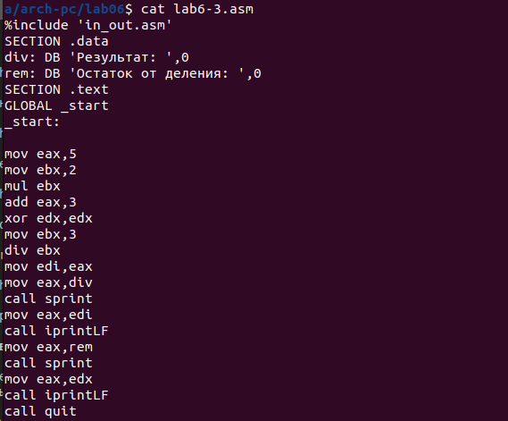
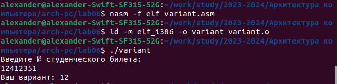

---
## Front matter
title: "Отчет по лабораторной работе №6"
subtitle: "Архитектура компьютера и операционные системы"
author: "Александр Дмитриевич Собко"

## Generic otions
lang: ru-RU
toc-title: "Содержание"

## Bibliography
bibliography: bib/cite.bib
csl: pandoc/csl/gost-r-7-0-5-2008-numeric.csl

## Pdf output format
toc: true # Table of contents
toc-depth: 2
lof: true # List of figures
lot: true # List of tables
fontsize: 12pt
linestretch: 1.5
papersize: a4
documentclass: scrreprt
## I18n polyglossia
polyglossia-lang:
  name: russian
  options:
  - spelling=modern
  - babelshorthands=true
polyglossia-otherlangs:
  name: english
## I18n babel
babel-lang: russian
babel-otherlangs: english
## Fonts
mainfont: PT Serif
romanfont: PT Serif
sansfont: PT Sans
monofont: PT Mono
mainfontoptions: Ligatures=TeX
romanfontoptions: Ligatures=TeX
sansfontoptions: Ligatures=TeX,Scale=MatchLowercase
monofontoptions: Scale=MatchLowercase,Scale=0.9
## Biblatex
biblatex: true
biblio-style: "gost-numeric"
biblatexoptions:
  - parentracker=true
  - backend=biber
  - hyperref=auto
  - language=auto
  - autolang=other*
  - citestyle=gost-numeric
## Pandoc-crossref LaTeX customization
figureTitle: "Рис."
tableTitle: "Таблица"
listingTitle: "Листинг"
lofTitle: "Список иллюстраций"
lotTitle: "Список таблиц"
lolTitle: "Листинги"
## Misc options
indent: true
header-includes:
  - \usepackage{indentfirst}
  - \usepackage{float} # keep figures where there are in the text
  - \floatplacement{figure}{H} # keep figures where there are in the text
---

# Цель работы

Освоение арифметических инструкций языка ассемблера NASM

# Задание

Изменить несколько программ с вводом, выводом и вычислением, затем написать свою

# Теоретическое введение

Большинство инструкций на языке ассемблера требуют обработки операндов. Адрес операнда предоставляет место, где хранятся данные, подлежащие обработке. Это могут быть
данные хранящиеся в регистре или в ячейке памяти. Далее рассмотрены все существующие
способы задания адреса хранения операндов – способы адресации.
Существует три основных способа адресации:
• Регистровая адресация – операнды хранятся в регистрах и в команде используются
имена этих регистров, например: mov ax,bx.
• Непосредственная адресация – значение операнда задается непосредственно в команде, Например: mov ax,2.
• Адресация памяти – операнд задает адрес в памяти. В команде указывается символическое обозначение ячейки памяти, над содержимым которой требуется выполнить
операцию.

Схема команды целочисленного сложения add (от англ. addition - добавление) выполняет
сложение двух операндов и записывает результат по адресу первого операнда

Команда целочисленного вычитания sub (от англ. subtraction – вычитание) работает аналогично команде add 

Довольно часто при написании программ встречается операция прибавления или вычитания единицы. Прибавление единицы называется инкрементом, а вычитание — декрементом.
Для этих операций существуют специальные команды: inc (от англ. increment) и dec (от англ.
decrement), которые увеличивают и уменьшают на 1 свой операнд.

Еще одна команда, которую можно отнести к арифметическим командам это команда
изменения знака neg

Умножение и деление, в отличии от сложения и вычитания, для знаковых и беззнаковых
чисел производиться по-разному, поэтому существуют различные команды.
Для беззнакового умножения используется команда mul (от англ. multiply – умножение)

Для знакового умножения используется команда imul

Для деления, как и для умножения, существует 2 команды div (от англ. divide - деление) и
idiv

Ввод информации с клавиатуры и вывод её на экран осуществляется в символьном виде.
Кодирование этой информации производится согласно кодовой таблице символов ASCII.
ASCII – сокращение от American Standard Code for Information Interchange (Американский
стандартный код для обмена информацией). Согласно стандарту ASCII каждый символ
кодируется одним байтом.
Расширенная таблица ASCII состоит из двух частей. Первая (символы с кодами 0-127)
является универсальной, а вторая (коды 128-255) предназначена для
специальных символов и букв национальных алфавитов и на компьютерах разных типов
может меняться.
Среди инструкций NASM нет такой, которая выводит числа (не в символьном виде). Поэтому, например, чтобы вывести число, надо предварительно преобразовать его цифры в
ASCII-коды этих цифр и выводить на экран эти коды, а не само число. Если же выводить число
на экран непосредственно, то экран воспримет его не как число, а как последовательность
ASCII-символов – каждый байт числа будет воспринят как один ASCII-символ – и выведет на
экран эти символы.
Аналогичная ситуация происходит и при вводе данных с клавиатуры. Введенные данные будут представлять собой символы, что сделает невозможным получение корректного
результата при выполнении над ними арифметических операций.
Для решения этой проблемы необходимо проводить преобразование ASCII символов в
числа и обратно.
Для выполнения лабораторных работ в файле in_out.asm реализованы подпрограммы
для преобразования ASCII символов в числа и обратно. Это:
• iprint – вывод на экран чисел в формате ASCII, перед вызовом iprint в регистр eax
необходимо записать выводимое число (mov eax,<int>).
• iprintLF – работает аналогично iprint, но при выводе на экран после числа добавляет
к символ перевода строки.
• atoi – функция преобразует ascii-код символа в целое число и записает результат
в регистр eax, перед вызовом atoi в регистр eax необходимо записать число (mov
eax,<int>)

# Выполнение лабораторной работы

## Символьные и численные данные в NASM

1. Создайте каталог для программам лабораторной работы № 6, перейдите в него и
создайте файл lab6-1.asm:

2. Рассмотрим примеры программ вывода символьных и численных значений. Программы будут выводить значения записанные в регистр eax

Введите в файл lab6-1.asm текст программы из листинга 6.1. В данной программе в регистр eax записывается символ 6 (mov eax,'6'), в регистр ebx символ 4 (mov ebx,'4').
Далее к значению в регистре eax прибавляем значение регистра ebx (add eax,ebx, результат сложения запишется в регистр eax). Далее выводим результат. Так как для работы
функции sprintLF в регистр eax должен быть записан адрес, необходимо использовать дополнительную переменную. Для этого запишем значение регистра eax в переменную buf1
(mov [buf1],eax), а затем запишем адрес переменной buf1 в регистр eax (mov eax,buf1) и
вызовем функцию sprintLF.

{#fig:001 width=70%}

Создайте исполняемый файл и запустите его.

{#fig:002 width=70%}

3. Далее изменим текст программы и вместо символов, запишем в регистры числа. Исправьте текст программы (Листинг 6.1) следующим образом: замените строки

{#fig:003 width=70%}

Создайте исполняемый файл и запустите его

{#fig:004 width=70%}

Да, отображается. Это символ перевода строки (line feed)

4. Как отмечалось выше, для работы с числами в файле in_out.asm реализованы подпрограммы для преобразования ASCII символов в числа и обратно. Преобразуем текст
программы из Листинга 6.1 с использованием этих функций.

Создайте файл lab6-2.asm в каталоге ~/work/arch-pc/lab06 и введите в него текст программы из листинга 6.2.

{#fig:005 width=70%}

Создайте и запустите исполняемый файл.

{#fig:006 width=70%}

5. Аналогично предыдущему примеру изменим символы на числа. Замените строки


{#fig:007 width=70%}

Создайте исполняемый файл и запустите его

{#fig:008 width=70%}

Замените функцию iprintLF на iprint. Создайте исполняемый файл и запустите его. Чем
отличается вывод функций iprintLF и iprint?

{#fig:009 width=70%}

iprint не добавляет символ перевода строки.

## Выполнение арифметических операций в NASM

6. В качестве примера выполнения арифметических операций в NASM приведем программу вычисления арифметического выражения f(x) = (5 * 2 + 3)/3.

Создайте файл lab6-3.asm в каталоге ~/work/arch-pc/lab06:

{#fig:010 width=70%}

Создайте исполняемый файл и запустите его

{#fig:011 width=70%}

Измените текст программы для вычисления выражения f(x) = (4 * 6 + 2)/5. Создайте
исполняемый файл и проверьте его работу.

{#fig:012 width=70%}

{#fig:013 width=70%}

7. В качестве другого примера рассмотрим программу вычисления варианта задания по
номеру студенческого билета, работающую по следующему алгоритму:
• вывести запрос на введение № студенческого билета
• вычислить номер варианта по формуле: (S_n mod 20) + 1, где S_n – номер студенческого билета (В данном случае a mod b – это остаток от деления a на b).
• вывести на экран номер варианта.

В данном случае число, над которым необходимо проводить арифметические операции,
вводится с клавиатуры. Как отмечалось выше ввод с клавиатуры осуществляется в символьном виде и для корректной работы арифметических операций в NASM символы необходимо преобразовать в числа. Для этого может быть использована функция atoi из файла
in_out.asm.
Создайте файл variant.asm в каталоге ~/work/arch-pc/lab06:

{#fig:014 width=70%}

Создайте и запустите исполняемый файл

{#fig:015 width=70%}

## Ответы на вопросы

1. Какие строки листинга 6.4 отвечают за вывод на экран сообщения ‘Ваш вариант:’?

```
mov eax,rem
call sprint
```
2. Для чего используется следующие инструкции?
```
mov ecx, x
mov edx, 80
call sread
```
Для ввода строки с клавиатуры

3. Для чего используется инструкция “call atoi”?

Для вызова подпрограммы преобразования ASCII кода в число

4. Какие строки листинга 6.4 отвечают за вычисления варианта?

```
xor edx,edx
mov ebx,20
div ebx
inc edx
```

5. В какой регистр записывается остаток от деления при выполнении инструкции “div
ebx”?

edx

6. Для чего используется инструкция “inc edx”?

Для увеличения edx на 1

7. Какие строки листинга 6.4 отвечают за вывод на экран результата вычислений?

```
mov eax, edx
call iprintLF
```


# Задание для самостоятельной работы

Написать программу вычисления выражения y = f(x). Программа должна выводить
выражение для вычисления, выводить запрос на ввод значения x, вычислять заданное выражение в зависимости от введенного x, выводить результат вычислений. Вид
функции f(x) выбрать из таблицы 6.3 вариантов заданий в соответствии с номером
полученным при выполнении лабораторной работы. Создайте исполняемый файл и
проверьте его работу для значений x1 и x2 из 6.3

{#fig:016 width=70%}

{#fig:017 width=70%}

Я взял пример под номером 1

# Выводы

Мы научились выделять память под переменные, также проводить арифметические операции с ними и в конце написали свою программу, считающую функцию от значения переменной х.

# Список литературы{.unnumbered}

::: {#refs}
:::
