---
## Front matter
title: "Отчет по лабораторной работе №6"
subtitle: "Архитектура компьютера и операционные системы"
author: "Александр Дмитриевич Собко"

## Generic otions
lang: ru-RU
toc-title: "Содержание"

## Bibliography
bibliography: bib/cite.bib
csl: pandoc/csl/gost-r-7-0-5-2008-numeric.csl

## Pdf output format
toc: true # Table of contents
toc-depth: 2
lof: true # List of figures
lot: true # List of tables
fontsize: 12pt
linestretch: 1.5
papersize: a4
documentclass: scrreprt
## I18n polyglossia
polyglossia-lang:
  name: russian
  options:
  - spelling=modern
  - babelshorthands=true
polyglossia-otherlangs:
  name: english
## I18n babel
babel-lang: russian
babel-otherlangs: english
## Fonts
mainfont: PT Serif
romanfont: PT Serif
sansfont: PT Sans
monofont: PT Mono
mainfontoptions: Ligatures=TeX
romanfontoptions: Ligatures=TeX
sansfontoptions: Ligatures=TeX,Scale=MatchLowercase
monofontoptions: Scale=MatchLowercase,Scale=0.9
## Biblatex
biblatex: true
biblio-style: "gost-numeric"
biblatexoptions:
  - parentracker=true
  - backend=biber
  - hyperref=auto
  - language=auto
  - autolang=other*
  - citestyle=gost-numeric
## Pandoc-crossref LaTeX customization
figureTitle: "Рис."
tableTitle: "Таблица"
listingTitle: "Листинг"
lofTitle: "Список иллюстраций"
lotTitle: "Список таблиц"
lolTitle: "Листинги"
## Misc options
indent: true
header-includes:
  - \usepackage{indentfirst}
  - \usepackage{float} # keep figures where there are in the text
  - \floatplacement{figure}{H} # keep figures where there are in the text
---

# Цель работы

Изучение команд условного и безусловного переходов. Приобретение навыков написания
программ с использованием переходов. Знакомство с назначением и структурой файла
листинга.

# Задание

Изменить пару программ с условиями и написать 2 свои

# Теоретическое введение

Для реализации ветвлений в ассемблере используются так называемые команды передачи
управления или команды перехода. Можно выделить 2 типа переходов:
• условный переход – выполнение или не выполнение перехода в определенную точку
программы в зависимости от проверки условия.
• безусловный переход – выполнение передачи управления в определенную точку программы без каких-либо условий.

Безусловный переход выполняется инструкцией jmp (от англ. jump – прыжок), которая
включает в себя адрес перехода, куда следует передать управление:
jmp <адрес_перехода>
Адрес перехода может быть либо меткой, либо адресом области памяти, в которую предварительно помещен указатель перехода. Кроме того, в качестве операнда можно использовать
имя регистра, в таком случае переход будет осуществляться по адресу, хранящемуся в этом
регистре

Как отмечалось выше, для условного перехода необходима проверка какого-либо условия.
В ассемблере команды условного перехода вычисляют условие перехода анализируя флаги
из регистра флагов

Флаг – это бит, принимающий значение 1 («флаг установлен»), если выполнено некоторое
условие, и значение 0 («флаг сброшен») в противном случае. Флаги работают независимо
друг от друга, и лишь для удобства они помещены в единый регистр — регистр флагов, отражающий текущее состояние процессора

# Выполнение лабораторной работы

## Реализация переходов в NASM

1. Создайте каталог для программам лабораторной работы № 7, перейдите в него и создайте файл lab7-1.asm

2. Инструкция jmp в NASM используется для реализации безусловных переходов. Рассмотрим пример программы с использованием инструкции jmp. Введите в файл lab7-1.asm
текст программы из листинга 7.1.

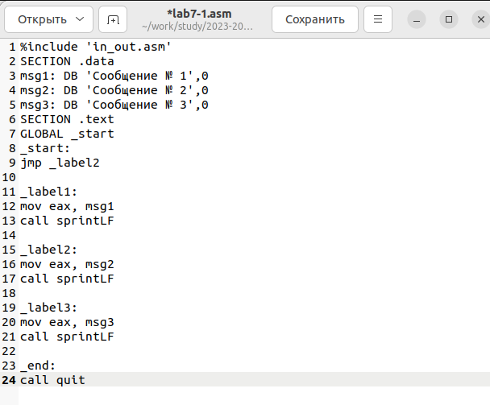{#fig:001 width=70%}

Создайте исполняемый файл и запустите его.

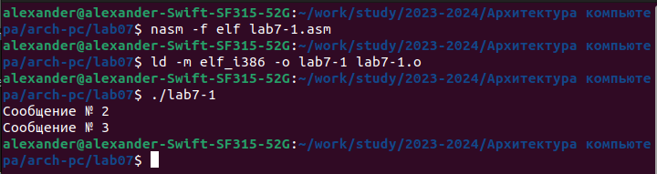{#fig:002 width=70%}

Таким образом, использование инструкции jmp label2 меняет порядок исполнения
инструкций и позволяет выполнить инструкции начиная с метки label2, пропустив вывод
первого сообщения.
Инструкция jmp позволяет осуществлять переходы не только вперед но и назад. Изменим
программу таким образом, чтобы она выводила сначала ‘Сообщение № 2’, потом ‘Сообщение
№ 1’ и завершала работу. Для этого в текст программы после вывода сообщения № 2 добавим
инструкцию jmp с меткой label1 (т.е. переход к инструкциям вывода сообщения № 1)
и после вывода сообщения № 1 добавим инструкцию jmp с меткой end (т.е. переход к
инструкции call quit). Измените текст программы в соответствии с листингом 7.2

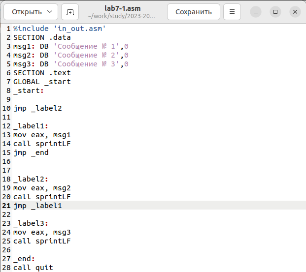{#fig:003 width=70%}

Создайте исполняемый файл и проверьте его работу

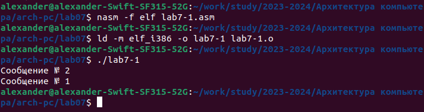{#fig:004 width=70%}

3. Использование инструкции jmp приводит к переходу в любом случае. Однако, часто при
написании программ необходимо использовать условные переходы, т.е. переход должен происходить если выполнено какое-либо условие. В качестве примера рассмотрим
программу, которая определяет и выводит на экран наибольшую из 3 целочисленных
переменных: A,B и C. Значения для A и C задаются в программе, значение B вводиться с
клавиатуры.

Создайте файл lab7-2.asm в каталоге ~/work/arch-pc/lab07. Внимательно изучите текст
программы из листинга 7.3 и введите в lab7-2.asm

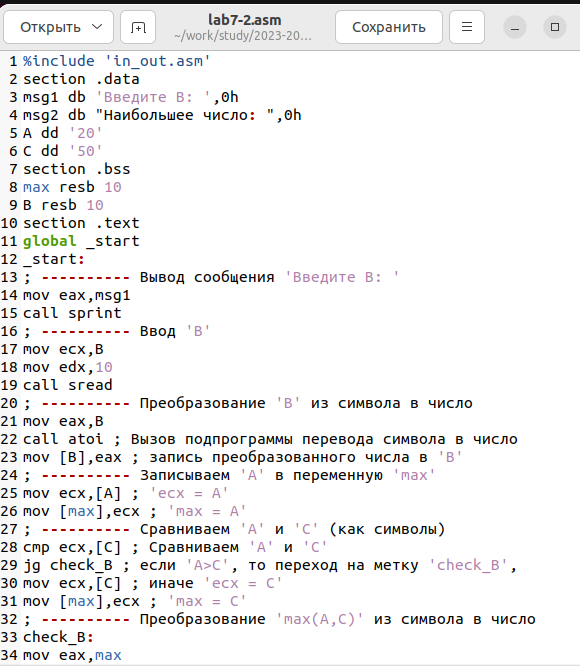{#fig:005 width=70%}

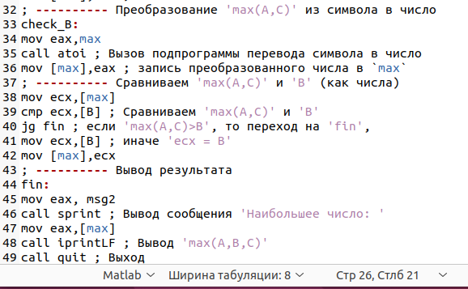{#fig:006 width=70%}

Создайте исполняемый файл и проверьте его работу для разных значений B.
Обратите внимание, в данном примере переменные A и С сравниваются как символы, а переменная B и максимум из A и С как числа (для этого используется функция atoi преобразования символа в число). Это сделано для демонстрации того, как сравниваются данные.
Данную программу можно упростить и сравнивать все 3 переменные как символы (т.е. не
использовать функцию atoi). Однако если переменные преобразовать из символов числа,
над ними можно корректно проводить арифметические операции.

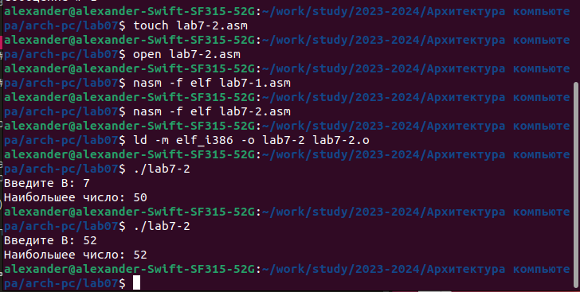{#fig:007 width=70%}

## Изучение структуры файлы листинга

4. Обычно nasm создаёт в результате ассемблирования только объектный файл. Получить
файл листинга можно, указав ключ -l и задав имя файла листинга в командной строке.
Создайте файл листинга для программы из файла lab7-2.asm
nasm -f elf -l lab7-2.lst lab7-2.asm
Откройте файл листинга lab7-2.lst с помощью любого текстового редактора, например
mcedit:
mcedit lab7-2.lst
Внимательно ознакомиться с его форматом и содержимым. Подробно объяснить содержимое трёх строк файла листинга по выбору.

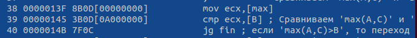{#fig:008 width=70%}

Строка в листинге состоит из номера строки в файле, смещении строки в программе (она больше номера строки потому что сначала в программу импортируется файл in_out.asm), затем следует оператор с операндами представленный в виде машинного кода, ну а затем то, как выглядит сама строчка в файле программы.

Откройте файл с программой lab7-2.asm и в любой инструкции с двумя операндами
удалить один операнд. Выполните трансляцию с получением файла листинга:
nasm -f elf -l lab7-2.lst lab7-2.asm
Какие выходные файлы создаются в этом случае? Что добавляется в листинге?

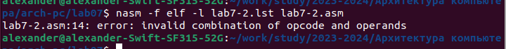{#fig:009 width=70%}

Никакие. Выводится ошибка

# Задание для самостоятельной работы

1. Напишите программу нахождения наименьшей из 3 целочисленных переменных a,b и c.
Значения переменных выбрать из табл. 7.5 в соответствии с вариантом, полученным
при выполнении лабораторной работы № 7. Создайте исполняемый файл и проверьте
его работу.

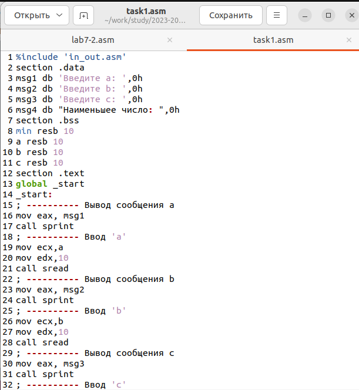{#fig:010 width=70%}

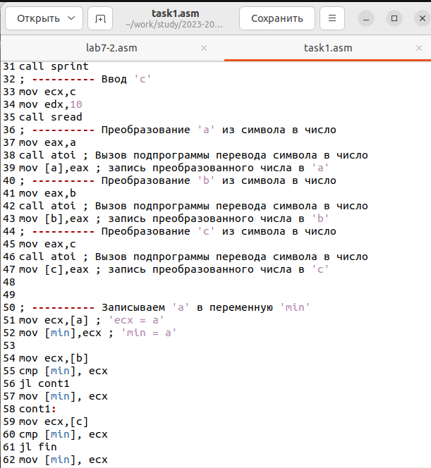{#fig:011 width=70%}

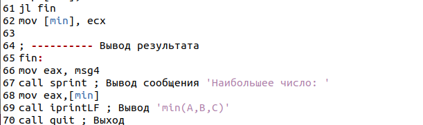{#fig:012 width=70%}

Я выбрал вариант 1

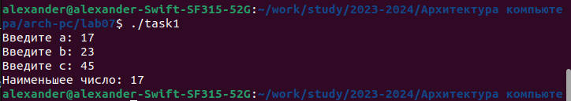{#fig:013 width=70%}

2. Напишите программу, которая для введенных с клавиатуры значений x и a вычисляет
значение заданной функции f(x) и выводит результат вычислений. Вид функции f(x)
выбрать из таблицы 7.6 вариантов заданий в соответствии с вариантом, полученным
при выполнении лабораторной работы № 7. Создайте исполняемый файл и проверьте
его работу для значений x и a из 7.6.

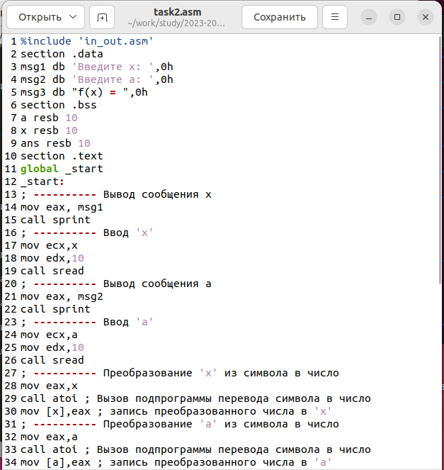{#fig:014 width=70%}

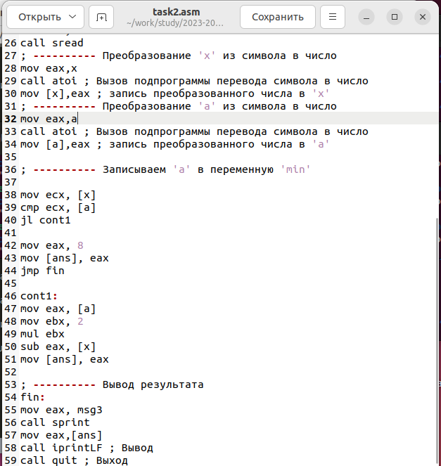{#fig:015 width=70%}

Вариант 1

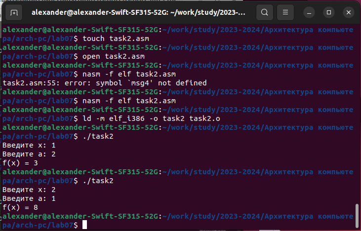{#fig:016 width=70%}

# Выводы

Мы научились составлять программы с условиями

# Список литературы{.unnumbered}

::: {#refs}
:::
