---
## Front matter
title: "Отчет по лабораторной работе №6"
subtitle: "Архитектура компьютера и операционные системы"
author: "Александр Дмитриевич Собко"

## Generic otions
lang: ru-RU
toc-title: "Содержание"

## Bibliography
bibliography: bib/cite.bib
csl: pandoc/csl/gost-r-7-0-5-2008-numeric.csl

## Pdf output format
toc: true # Table of contents
toc-depth: 2
lof: true # List of figures
lot: true # List of tables
fontsize: 12pt
linestretch: 1.5
papersize: a4
documentclass: scrreprt
## I18n polyglossia
polyglossia-lang:
  name: russian
  options:
  - spelling=modern
  - babelshorthands=true
polyglossia-otherlangs:
  name: english
## I18n babel
babel-lang: russian
babel-otherlangs: english
## Fonts
mainfont: PT Serif
romanfont: PT Serif
sansfont: PT Sans
monofont: PT Mono
mainfontoptions: Ligatures=TeX
romanfontoptions: Ligatures=TeX
sansfontoptions: Ligatures=TeX,Scale=MatchLowercase
monofontoptions: Scale=MatchLowercase,Scale=0.9
## Biblatex
biblatex: true
biblio-style: "gost-numeric"
biblatexoptions:
  - parentracker=true
  - backend=biber
  - hyperref=auto
  - language=auto
  - autolang=other*
  - citestyle=gost-numeric
## Pandoc-crossref LaTeX customization
figureTitle: "Рис."
tableTitle: "Таблица"
listingTitle: "Листинг"
lofTitle: "Список иллюстраций"
lotTitle: "Список таблиц"
lolTitle: "Листинги"
## Misc options
indent: true
header-includes:
  - \usepackage{indentfirst}
  - \usepackage{float} # keep figures where there are in the text
  - \floatplacement{figure}{H} # keep figures where there are in the text
---

# Цель работы

Приобретение навыков написания программ с использованием циклов и обработкой
аргументов командной строки.

# Задание

Отредактировать данные программы с циклами и использованием аргументов командной строки, понять как работают в ассемблере циклы и что самое главное СТЕК.

# Теоретическое введение

Стек — это структура данных, организованная по принципу LIFO («Last In — First Out»
или «последним пришёл — первым ушёл»). Стек является частью архитектуры процессора и
реализован на аппаратном уровне. Для работы со стеком в процессоре есть специальные
регистры (ss, bp, sp) и команды.
Основной функцией стека является функция сохранения адресов возврата и передачи
аргументов при вызове процедур. Кроме того, в нём выделяется память для локальных
переменных и могут временно храниться значения регистров.
На рис. 8.1 показана схема организации стека в процессоре.
Стек имеет вершину, адрес последнего добавленного элемента, который хранится в регистре esp (указатель стека). Противоположный конец стека называется дном. Значение,
помещённое в стек последним, извлекается первым. При помещении значения в стек указатель стека уменьшается, а при извлечении — увеличивается.
Для стека существует две основные операции:
• добавление элемента в вершину стека (push);
• извлечение элемента из вершины стека (pop).

Команда push размещает значение в стеке, т.е. помещает значение в ячейку памяти, на
которую указывает регистр esp, после этого значение регистра esp увеличивается на 4.
Данная команда имеет один операнд — значение, которое необходимо поместить в стек.

Существует ещё две команды для добавления значений в стек. Это команда pusha, которая
помещает в стек содержимое всех регистров общего назначения в следующем порядке: ах,
сх, dx, bх, sp, bp, si, di. А также команда pushf, которая служит для перемещения в стек
содержимого регистра флагов. Обе эти команды не имеют операндов.

Команда pop извлекает значение из стека, т.е. извлекает значение из ячейки памяти, на
которую указывает регистр esp, после этого уменьшает значение регистра esp на 4. У этой
команды также один операнд, который может быть регистром или переменной в памяти.
Нужно помнить, что извлечённый из стека элемент не стирается из памяти и остаётся как
“мусор”, который будет перезаписан при записи нового значения в стек.

Для организации циклов существуют специальные инструкции. Для всех инструкций
максимальное количество проходов задаётся в регистре ecx. Наиболее простой является инструкция loop. 

# Выполнение лабораторной работы

## Реализация циклов в NASM

Создайте каталог для программам лабораторной работы № 8, перейдите в него и создайте
файл lab8-1.asm

При реализации циклов в NASM с использованием инструкции loop необходимо помнить
о том, что эта инструкция использует регистр ecx в качестве счетчика и на каждом шаге
уменьшает его значение на единицу. В качестве примера рассмотрим программу, которая
выводит значение регистра ecx. Внимательно изучите текст программы (Листинг 8.1).

Введите в файл lab8-1.asm текст программы из листинга 8.1. Создайте исполняемый файл и проверьте его работу.

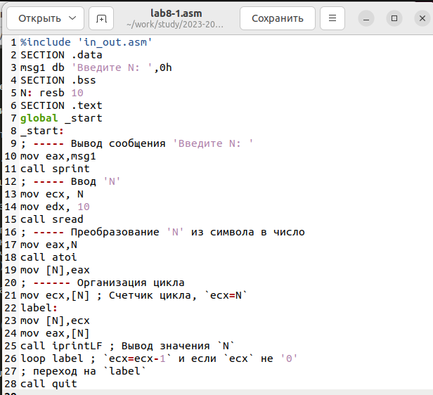{#fig:001 width=70%}

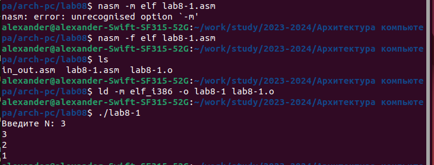{#fig:002 width=70%}

Данный пример показывает, что использование регистра ecx в теле цилка loop может
привести к некорректной работе программы. Измените текст программы добавив изменение
значение регистра ecx в цикле

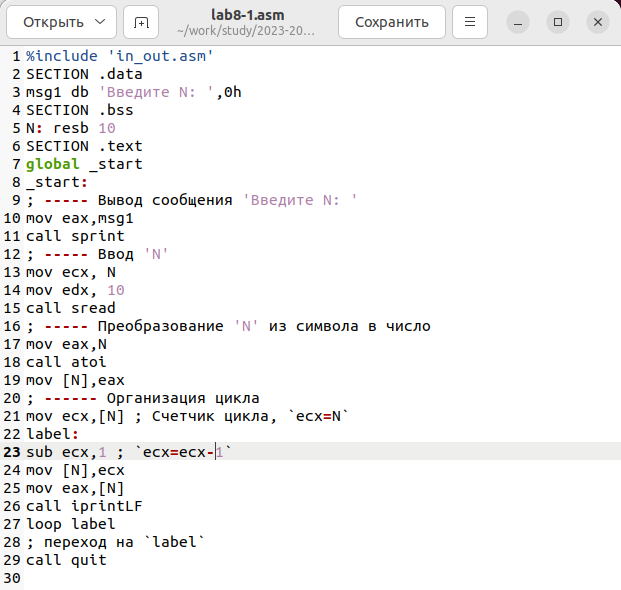{#fig:003 width=70%}

Создайте исполняемый файл и проверьте его работу. Какие значения принимает регистр
ecx в цикле? Соответствует ли число проходов цикла значению N введенному с клавиатуры?

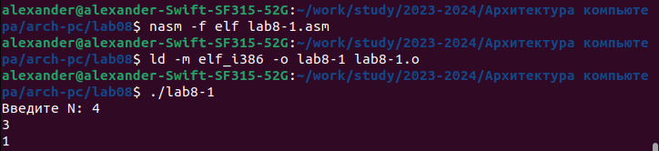{#fig:004 width=70%}

Принимает нечетные значения. Не соответствует.

Для использования регистра ecx в цикле и сохранения корректности работы программы
можно использовать стек. Внесите изменения в текст программы добавив команды push
и pop (добавления в стек и извлечения из стека) для сохранения значения счетчика цикла
loop

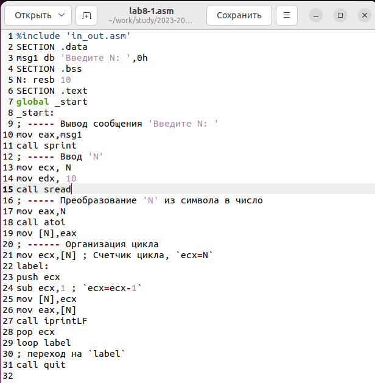{#fig:005 width=70%}

Создайте исполняемый файл и проверьте его работу. Соответствует ли в данном случае
число проходов цикла значению N введенному с клавиатуры?

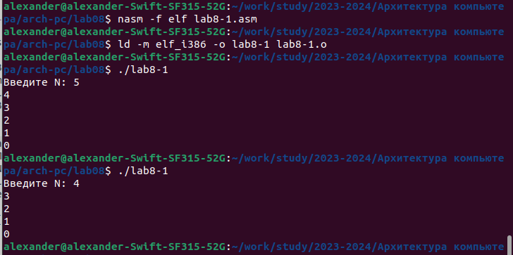{#fig:006 width=70%}

Соответствует.

## Обработка аргументов командной строки

При разработке программ иногда встает необходимость указывать аргументы, которые
будут использоваться в программе, непосредственно из командной строки при запуске
программы.
При запуске программы в NASM аргументы командной строки загружаются в стек в обратном порядке, кроме того в стек записывается имя программы и общее количество аргументов.
Последние два элемента стека для программы, скомпилированной NASM, – это всегда имя
программы и количество переданных аргументов.
Таким образом, для того чтобы использовать аргументы в программе, их просто нужно
извлечь из стека. Обработку аргументов нужно проводить в цикле. Т.е. сначала нужно извлечь из стека количество аргументов, а затем циклично для каждого аргумента выполнить
логику программы. В качестве примера рассмотрим программу, которая выводит на экран
аргументы командной строки. Внимательно изучите текст программы (Листинг 8.2).

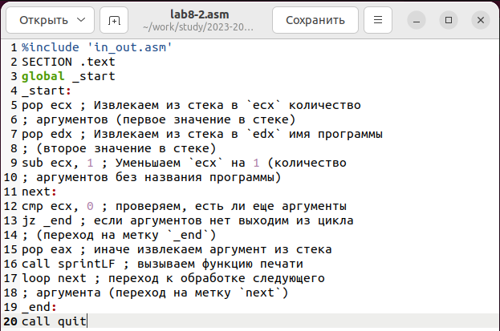{#fig:007 width=70%}

Создайте файл lab8-2.asm в каталоге ~/work/arch-pc/lab08 и введите в него текст программы из листинга 8.2.
Создайте исполняемый файл и запустите его

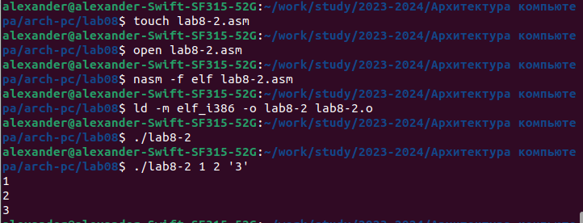{#fig:008 width=70%}

Сколько аргументов было обработано программой? -Все

Рассмотрим еще один пример программы которая выводит сумму чисел, которые передаются в программу как аргументы. Создайте файл lab8-3.asm в каталоге ~/work/archpc/lab08 и введите в него текст программы из листинга 8.3.

Создайте исполняемый файл и запустите его, указав аргументы

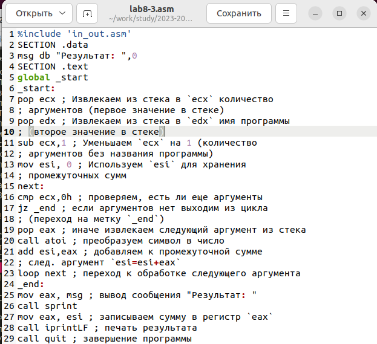{#fig:009 width=70%}

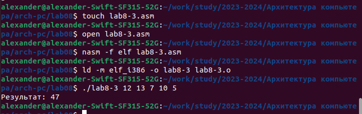{#fig:010 width=70%}

Измените текст программы из листинга 8.3 для вычисления произведения аргументов
командной строки.

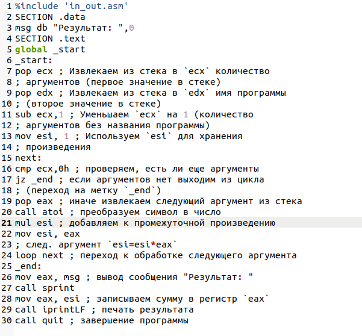{#fig:011 width=70%}

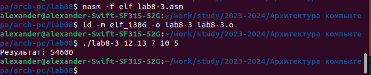{#fig:012 width=70%}

# Задание для самостоятельной работы

1. Напишите программу, которая находит сумму значений функции f(x) для
x = x1,x2,...,xn, т.е. программа должна выводить значение f(x1)+f(x2)+...+f(xn).
Значения x_i передаются как аргументы. Вид функции f(x) выбрать из таблицы
8.1 вариантов заданий в соответствии с вариантом, полученным при выполнении
лабораторной работы № 7. Создайте исполняемый файл и проверьте его работу на
нескольких наборах x = x1, x2,...,xn.

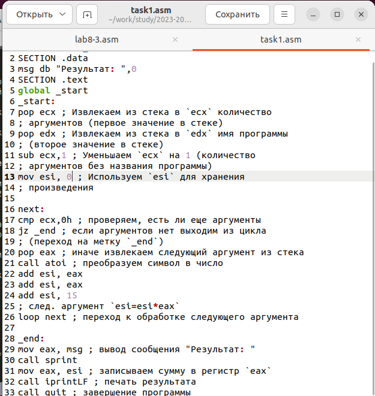{#fig:013 width=70%}

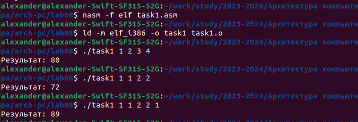{#fig:014 width=70%}

Опять же вариант 1.

# Выводы

Мы научились писать программы с циклами, также обрабатывать аргументы командной строки и работать со стеком.

# Список литературы{.unnumbered}

::: {#refs}
:::
